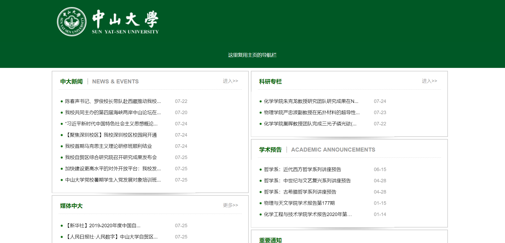

# NO.0 Consulting Page

> Author:：张云青
>
> Sid：17343157 


## 完成时间

2020.7.24


## 功能描述

新闻资讯页，有中大新闻、科研专栏、媒体中大、学术预告、重要通知等模块，点击新闻可跳转到具体内容页面，点击更多跳转到中大新闻页

## 界面展示



## 技术开发笔记

页面主要采用html+css进行页面构建，只在选择新闻的时候引入部分JavaScript.

**相关参数：**

- 新闻部分总宽度1000px
- 每个模块宽度490px,margin为5px 5px 0px 0px
- 模块标题14px，新闻标题12px

**主要技术**

- 采用js实现鼠标移动到不同标题切换页面：

	新闻模块有两个部分，分别是中大新闻和 NEWS & EVENTS，在span的onMouseOver属性调用js函数switchNews进行页面转换，switchNews函数如下：

```css
	function switchNews(sysunews,newslist)
	{
		for(i=1; i <3; i++)
		{
			if ("sysunews0"+i==sysunews)
			{
				document.getElementById("sysunews0"+i).className="";
				
			}else{
				document.getElementById("sysunews0"+i).className="newsdown";
				
			}
			if ("newslist0"+i==newslist)
			{
				document.getElementById(newslist).className="";
			}else{
				document.getElementById("newslist0"+i).className="hidecontent";
			}
		}
	}

```

- 阴影分隔线的实现

	阴影分割线是在css中设置背景图为阴影图，并设置属性为no-repeat bottom center，然后把这个属性作为父元素的属性。

	```css
	.channel_shadow{
	padding:0px 0px 5px 0px;
	background:url(../images/bo-shadow.jpg) no-repeat bottom center;
	}
	```

- 切换模块内容只修改内部元素

	切换新闻和媒体的另一个模块时采用的是iframe标签，可以在不改变外框架的情况下修改内部元素：

	```css
	<iframe id="ifmtzd" src="" frameborder="0" scrolling="no" height="196" width="356" noresize="noresize"></iframe> 
	```


## 测试流程

### 静态代码分析

- [W3C Markup Validation Service]( https://validator.w3.org/ ) 检查通过

- [W3C CSS Validation Service]( http://jigsaw.w3.org/css-validator/ )检查通过 

### 单元测试

- 检测用户鼠标在各个按钮悬停时是否能正常切换子页面
- 检测点击更多是否能跳转到中大新闻网
- 检测点击新闻能否跳转到详情

测试结果：

- 鼠标悬停在“中大新闻”和“NEWS&EVENTS”标题时，模块内可分别显示中文和英文的中大新闻子页；悬停在“学术预告”和“ACADEMIC ANNOUNCEMENTS”标题时，模块内可分别显示中文和英文的预告
- 点击更多和进入按钮会跳转到中山大学新闻网
- 点击“中大新闻”、“科研专栏”和“媒体中大”标题下的文章题目可以跳转到中山大学新闻网的对应新闻，点击“NEWS&EVENTS”标题下的文章题目会跳转到中山大学英文版网页新闻，点击“学术预告”标题下的文章标题可以查看对应讲座或访谈的通知，点击“ACADEMIC ANNOUNCEMENTS”下文章标题显示英文版讲座通知，点击“重要通知”下文章标题显示通知原文。
- 鼠标悬停在文章标题显示文章全名


### 集成测试

- 与其他页面联动测试，检查页面能否正常跳转，单元测试功能是否正常

### 测试用例

- 鼠标分别悬停到“中大新闻”和“NEWS & EVENTS”上
- 鼠标分别悬停到“学术预告”和“ACADEMIC ANNOUNCEMENTS”
- 点击“更多”和“进入”按钮
- 随机点击每个模块中的新闻标题