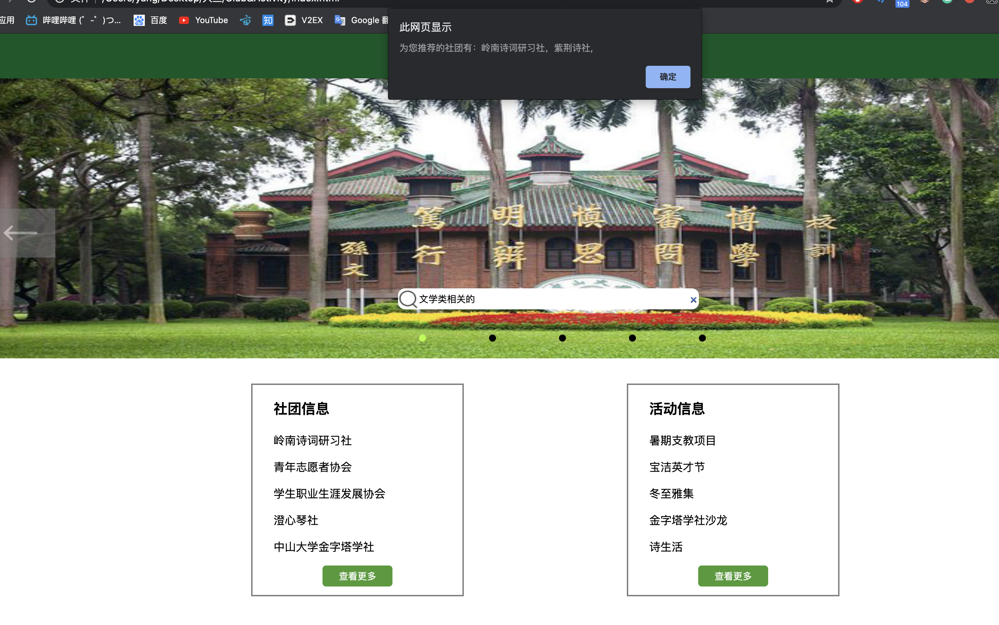

# 技术开发笔记

**17343140 杨泽涛**

## 涉及技术
1. 伪类
2. Flask
3. 原生JavaScript

## 开发内容

开发完成**社团和活动**功能，具体实现内容有：

1. 收集中山大学学生社团相关信息和活动相关内容

2. 主界面的背部图片轮动效果，要求可以点击箭头和下列原点进行切换
3. 实现社团搜索关键词推荐相关社团功能
4. 实现社团详细信息查看功能
5. 实现活动详细信息查看功能
6. 实现社团报名功能
7. 实现活动报名功能

## 开发记录

### 七月二十日

收集了中山大学相关学生社团的信息，具体包括：岭南诗词研习社，青年志愿者协会，学生职业生涯发展协会，澄心琴社和中山大学金字塔琴社的信息。

收集了社团相关活动信息，具体包括：暑期支教项目，宝洁英才节，冬至雅集，金字塔学社沙龙，诗生活。

开始了主页面的背部图片轮转功能的实现，暂时只实现了图片自动轮转的效果。

遇到的困难有：不知道如何实现图片轮转的效果，经过尝试发现实现思路应该是将图片以浮动形式放在div中，并且设置div为溢出隐藏，在需要切换图片的时候应该移动的是div的位置，这样用户看起来就是图片在移动的效果了。实现完基本的图片切换功能后又遇到一个困难是不知道如何实现图片轮转的效果（即从最后一张图片返回到第一张图片），经过思考后决定在原有图片之前加上最后一个图片，并在图片列表之后加上第一个图片，一前一后两个图片作为假象迷惑用户，当列表移动到这两个图片位置时，列表会瞬间改变位置到图片列表首或图片列表尾，这样就实现了循环的效果。

### 七月二十一日

继续开发主页面背部图片轮转功能，加入了箭头切换功能

并且加入底部索引图标功能，该索引亦可用于图片切换

红色为鼠标位置，绿色为当前图片位置。

遇到的困难有：下列索引的颜色显示功能一开始不知道如何实现，后面的解决思路是利用class=”light“这个类标注来标注某个圆点是否正在展示图片，并在css样式表中对正在展示图片的原点的颜色改成绿色。鼠标悬停改变成红色以及两个箭头位置鼠标悬停背景变成灰白这一功能的实现是通过hover伪类实现的。

### 七月二十三日

完成了主页面和社团页面，活动页面的UI布置：

通过组内协商，顶部和底部的导航栏由负责主页的同学统一设计，所以我先预留相关位置，并配上相应主题色。

遇到的困难：单纯的UI设计很简单，但是要适应不同尺寸的屏幕的UI就需要设计好各个div盒的定位，不能直接粗暴地使用绝对定位，因为这样会在不同尺寸的电脑屏幕上出现错位，要尽量使用window.screen的相关参数（包括width，height）来进行位置定位。

### 七月二十四日

实现搜索功能和社团报名，活动报名功能。

遇到的困难：搜索功能一开始不知道怎么实现，后面是使用关键词搜索法实现的。通过用户输入的字符，从中筛选出相关的关键词，通过关键词来进行社团的推荐，若没有推荐社团，则通知用户暂无相关社团。

### 七月二十五日

开发了社团报名和活动报名的功能。

遇到的困难：报名功能的实现一开始没有头绪，因为我们暂时还没有一个完整的账号管理系统，所以我的解决方案是将报名信息写到本地csv文件里面，但是这样做遇到一个问题就是JavaScript不支持对本机的任何读写行为，所以我只能自己搭建一个简易后端，监听5010端口，通过JavaScript对5010端口发送数据，然后在后端将数据追加到我们的csv数据库中。

### 整合工作

在第一次sprint会议之后，我对我的各个页面进行了导航栏整合工作，解决了css和js的各种样式冲突问题。

## 开发总结

本次开发收获很多，用上了很多当初Web2.0课程学习到的知识，中间也遇到了不少以前没有遇到的困难，很幸运能够顺利解决它们。经过本科三年的学习，我发现我已经对前后端和数据处理，数据传送都有一定的了解，遇到相关问题能够比较快地找到解决思路，从而能顺利完成一个简单项目，这是我最大的收获。

本次开发也是我第一次正式在一个正规项目开发组下的监督进行的，我对开发进度，看板使用和项目管理都有了一个比较深的理解。

