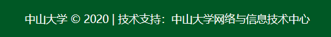
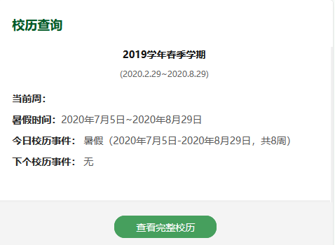

[TOC]

# NO.8 Design & Integration

> - Author: 朱龙威
> - Sid: 17343165

## 完成时间

2020.7.21

## 框架设计

本项目为轻量级网页应用开发项目,使用vue-cli脚手架进行单页面开发

[教程地址](<https://cli.vuejs.org/zh/>)

vue简单使用

1. 使用npm安装webpack和vue-cli脚手架

   ```
   npm install webpack -g
   npm install -g vue-cli
   ```

2. 创建并启动项目

   ```
   vue init webpack my-project
   npm run dev
   ```

3. 开发完成后打包项目

   ```
   npm run build
   ```

项目目录介绍


## 设计规范

主题色:

中山大学主题色

rgb: (0,88,38)

hex: #005826

页面主题色

rgb: (0,128,0)

hex: #008000

## 原型设计

合并1 6和4 5的需求,总计4个主页面

### 主页

#### 功能需求:

主页导航

新闻资讯

健康申报

课程表,校车,考试时间,校历等的查询

成绩查询,培养计划查询等教务服务

选课服务和课程查询,选课推荐

体育场地预订

新活,教室等申请服务

#### 页面设计

顶部为页面页眉,高度64px,有中大LOGO,有5个标签,分别是"我的主页","新闻公告","生活服务","社团服务","地图服务"点击可跳转对应页面,默认选择为我的主页.背景色为中大主题色,文字为白色


底部为页面页脚,高度51px,文字居中显示"技术支持: BBCUnion",背景色为主题色,文字为白色



右部侧边栏有编辑卡片,添加卡片,回到顶部的选项,保持页面相对位置不变

 

点击编辑卡片可选择拖动或删除当前页面的卡片


点击添加卡片可以选择更多的卡片显示在我的主页


灰色为未添加的卡片

底部有确定,取消和恢复默认的选项

##### 我的主页子页面

顶部有功能导航栏,展示圆形图标list(横向排布),有"健康申报","本科教务管理系统"(包含成绩查询,考试时间,选课服务),"体育场地预订","新活场地申请"等,点击可跳转对应的官方网址


页面主体由卡片组成,主要有4个卡片,日历日程,课程表展示,校车查询和校历查询


左边是日历,可在下方查看校历,有添加日程功能,点击"添加私人日程"弹出窗口


右边是课程表查看,可按周查询,点击弹出下拉选择窗口


右下是校车查询和校历查询


选择周几和校园起点终点显示校车日程



点击查看完整校历弹出窗口显示校历图片


##### 新闻公告子页面

页面主题由卡片构成,格式如下


点击某一项弹出新页面预览文档或下载


点击查看更多跳转子页面展示新闻列表


1页展示20项,底部有分页器


### 生活服务

#### 功能需求

公众号资源推荐,可跳转,至少5个,list展示

校园卡服务

订水,失物招领

网络中心

#### 页面设计

顶部为功能图标栏,主要有"校园卡服务","订水","失物招领","网络中心",点击可以跳转到对应官方网站


页面主题以卡片形式展示为中山大学学生提供生活服务的公众号,点击查看详情按钮可以跳转对应公众号的微信网站

主要有"中山大学校园卡","中山大学总务后勤服务","中山大学信息技术服务帮助台","体适能","中山大学团委"等卡片,卡片格式如下:


公众号名称水平居中,左边贴图是公众号logo

按钮背景色:

rgb:(70,159,93)

每行展示2个卡片

### 社团服务

#### 功能需求

信息查询

社团推荐

社团活动报名

#### 页面设计

顶部为大图,水平居中搜索框,提供信息查询功能

图片主要为展示中山大学学生的社团活动多姿多彩,体现中山大学学生充满青春活力,可在推文中随机选取展示或做成轮播图

搜索框为圆角矩形,左边有搜索图标,提示文字为"搜索",输入文字后右边有个小型"x"图标,点击可以清除文本框内文字

主体为卡片,有社团推荐,社团活动列表


### 地图服务

#### 功能需求

东校园内 校园周边娱乐健身服务等地图位置服务

信息查询,地图标点,标签分类

#### 页面设计

接入百度地图或高德地图等api,默认显示位置为中山大学东校园

页面主体为中山大学东校园地图


滑动鼠标滚轮可以放大缩小,同时左下角的地图比例也会随之改变

 

搜索框在左上角,点击下拉弹窗,有"校内设施","周边娱乐"和"健身设施"3个图标,并可以显示搜索历史和选择删除历史


右上角为筛选标签,勾选"校内","周边"便可以筛选出对应的地图标点


## 注意事项

主要参考中山大学统一门户网站进行开发,展示类内容使用卡片来布局;在设计中没有提及的功能不需要开发,在实际开发过程中可依照自己想法增加或删除细节