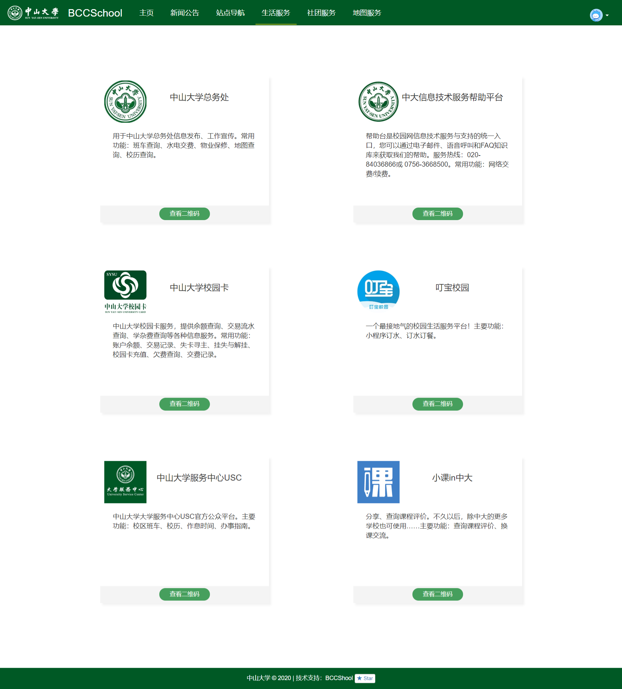

# NO.2 Public

> - Author: 张伟焜
> - Sid: 17343155

## 完成时间

2020.7.24

## 功能描述

提供有用的公众号的收集，能方便的跳转到对应公众号(显示二维码)

具体的公众号有：中山大学总务处、 中大信息技术服务帮助平台、 中山大学校园卡、叮宝校园、 中山大学服务中心USC 、 小课in中大。

以卡片形式展示公众号信息：

- 公众号标志(头像)
- 公众号名称
- 公众号简介及常用功能
- 查看二维码按钮。(当鼠标悬停于按钮上，会在按钮上方弹出二维码)

## 界面展示



## 技术开发笔记

静态页面开发，仅使用html+css构建页面。

**相关参数：**

- 卡片大小：400*346px
- 头像与二维码大小：100*100px
- 卡片标题字号：20px
- 卡片文字字号：16px
- 卡片定位：
  - 第一行距顶部100px
  - 第二行距顶部550px
  - 第三行距顶部1000px
  - 每行卡片左右间距200px
- 页面背景色：#FBFEFC
- 导航栏与底部颜色：#005826
- 按钮颜色：#469F5D(非鼠标悬停状态) #005826(鼠标悬停状态)

**技术亮点：**

- hover

  ```css
  .btn:hover{
  	background-color: #005826;
  }
  
  
  .btn:hover + #hide{
  	display: block;
  }
  ```

  由于`.btn` 与 `#hide`是兄弟元素，所以使用`+`；若`#hide`是`.btn`子元素，使用空格即可。

- 卡片边框及阴影

  ```css
  .card{
  	background-color:  #ffffff;
  	width: 400px;
  	height: 346px;
  	position: absolute;
  	float: left;
  	border: 1px;
  	box-shadow: 5px 5px 5px 0 rgba(0, 0, 0, .05);
  }
  ```

- 定位方式

  采用子元素绝对定位，父元素相对定位，能够很好地适应浏览器大小的变化。

