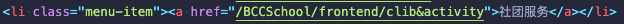

# BCCSchool 测试1

> - Time: 2020.7.29 16:19
> - Tester: 张涵健

## 一、测试内容

1. 静态代码测试
2. 部署后测试用例测试


## NO.0 Consulting

### 1. 静态代码分析

- [W3C Markup Validation Service]( https://validator.w3.org/ ) 检查通过

- [W3C CSS Validation Service]( http://jigsaw.w3.org/css-validator/ )检查通过 

### 2. 单元测试

- 检测用户鼠标在各个按钮悬停时是否能正常切换子页面
- 检测点击更多是否能跳转到中大新闻网
- 检测点击新闻能否跳转到详情

测试结果：

- 鼠标悬停在“中大新闻”和“NEWS&EVENTS”标题时，模块内可分别显示中文和英文的中大新闻子页；悬停在“学术预告”和“ACADEMIC ANNOUNCEMENTS”标题时，模块内可分别显示中文和英文的预告
- 点击更多和进入按钮会跳转到中山大学新闻网
- 点击“中大新闻”、“科研专栏”和“媒体中大”标题下的文章题目可以跳转到中山大学新闻网的对应新闻，点击“NEWS&EVENTS”标题下的文章题目会跳转到中山大学英文版网页新闻，点击“学术预告”标题下的文章标题可以查看对应讲座或访谈的通知，点击“ACADEMIC ANNOUNCEMENTS”下文章标题显示英文版讲座通知，点击“重要通知”下文章标题显示通知原文。
- 鼠标悬停在文章标题显示文章全名


### 3. 集成测试

- 与其他页面联动测试，检查页面能否正常跳转，单元测试功能是否正常

### 4. 测试用例

- 鼠标分别悬停到“中大新闻”和“NEWS & EVENTS”上
- 鼠标分别悬停到“学术预告”和“ACADEMIC ANNOUNCEMENTS”
- 点击“更多”和“进入”按钮
- 随机点击每个模块中的新闻标题

## NO.1 Website

(缺乏文档)

## NO.2 Public

### 1. 静态代码分析

- [W3C Markup Validation Service]( https://validator.w3.org/ ) 检查通过

- [W3C CSS Validation Service]( http://jigsaw.w3.org/css-validator/ )检查通过 

### 2. 单元测试

- 检测用户鼠标在各个按钮悬停时是否能正常弹出二维码
- 检测二维码是否与卡片对应，扫描后能够跳转到正确的公众号
- 缩放页面，观察各个控件的布局是否错乱

### 3. 集成测试

- 与其他页面联动测试，检查页面能否正常跳转，单元测试功能是否正常

### 测试用例

缩放页面，观察布局情况

中山大学总务处二维码获取

中大信息技术服务帮助平台二维码获取

 中山大学校园卡二维码获取

叮宝校园二维码获取

中山大学服务中心USC 二维码获取

小课in中大二维码获取

## NO.3 Community

### 1.静态代码分析

VSCode自检测，消除所有warning与error，并且加上注释

### 2.单元测试

1. 图片轮转是否正常（打开主页面）
2. 左右切换箭头是否正常（点击切换箭头）
3. 圆点切换和显示是否正常 （点击圆点）
4. 搜索结果是否正常返回 （输入关键词搜索）
5. 报名社团是否正常 （填写相关字段进行报名）
6. 报名活动是否正常 （填写相关字段进行报名)
7. 社团图标是否正常显示 （进入社团详情页）

### 3.集成测试

从进入网页查看社团图片，搜索推荐社团到报名社团，报名活动一系列操作。

### 4.测试用例

单元测试：

1. 进入网页，点击左右箭头
2. 进入网页，点击下方圆点
3. 进入网页搜索关键词
4. 进入网页进行社团报名
5. 进入网页进行活动报名

## NO.4 SchoolPlace

### 1. 静态代码测试
使用插件来进行相关语法监测：
1. htmlhint对html语法进行检测；
2. stylelink对css语法进行监测。


### 2. 单元测试
1. 网页是否能够成功打开：点击index.html文件在网站中打开。
2. 网页在各个浏览器显示是否正常：分别在safari与google浏览器进行测试，能够正常显示运行。
3. 能否在搜索框中输入地点：点击搜索框，进行文本的输入。
4. 点击搜索按钮后能否进行对输入地点进行搜索：在搜索框中输入字符串，点击按钮搜索。
5. 能否搜索出匹配的所有地点：在搜索框中输入地点，如“至善园”，地图上显示至善园的所有建筑。
6. 地图能否根据搜索到的地点自动移动到该位置：输入某个地点，点击搜索，查看网站地图中心为该地点。
7. 搜索没有标注的地点显示弹窗提示。

### 3. 测试用例
1. 输入“至善园”，显示所有至善园的建筑，并将地图中心移动到所有建筑的中心位置。


2. 输入至善园11号，没有该地点，进行弹窗提示


## NO.5 Entertainment

### 1. 静态代码分析

VSCode自检测，消除所有warning和error

### 2. 单元测试

1. 地图是否成功显示？（直接打开页面）
2. Sport是否成功显示？（点击Sport按钮）
3. Entertainment是否成功显示？（点击Entertainment按钮）
4. Restaurant是否成功显示？（点击Restaurant按钮）
5. Romantic spot是否成功显示？（点击Romantic spot按钮）
6. 导航栏功能是否正常？
7. 地图是否能自动聚焦返回？

### 3. 集成测试

点击其中一个Marker按钮，再点另一个按钮，其他按钮显示的地点是否会消失？

### 4. 测试用例

单元测试：

1. 进入网页，点击Sport、点击Entertainment、点击Sport
2. 进入网页，点击Restaurant、点击Entertainment、点击Romatic spot
3. 进入网页，鼠标在地图上滑动滚轮、拖动滚轮

集成测试：

1. 进入网页，点击Romatic spot，滑动滚轮缩小地图，再放大地图、拖动地图、点击Sport、滑动滚轮缩小地图，再放大地图、拖动地图

## NO.6 Main

### 1. 静态代码分析

+ VSCode自检测，消除所有warning和error


### 2. 单元测试

+ 导航栏是否能够正确选择当前页面对应的菜单项
+ 页面向下滚动时功能介绍部分能否正确显示

+ 各个链接是否能够正确跳转


## 二、测试结果（由问题严重度 重到轻排序）（没问题的测试不列出）

### NO.3 club&activity

负责人：yzt

1. 工程目录没有按照主页readme命名，与需求不符
2. 由于第一点，`&`符号引发网络地址连接问题，无法导航到

修改建议：

1. 将`club&activity`目录改名为`community`

### NO.4 SchoolPlace

负责人：zjw

1. 未遵循第一次迭代后的代码目录各式（zh提出的地址标准）

修改建议：

1. 将 `frontend/SchoolPlace/schoolPlace` 文件路径修改为 `frontend/SchoolPlace`(即文件夹提前一级)

### NO.0 Consulting

负责人：zyq

1. 点击导航栏跳转没有成功跳转（原因：地址缺失未及时填补）

修改建议：

1. 填补导航栏的地址（详情见第3点）

### NO.1 Website

负责人：wjp

1. 没有写 README，该文档上面的测试内容无法填写

### NO.0 Main

负责人：xk

1. 连接地址错误（但该地址本身就是无效的，若有效地址错误则加大了迭代成本）



## 三、导航栏统一修改（涉及所有页面）

> 说明：这些地址是部署在服务器上用的，在本地运行是不正常的

修改内容：社团服务的连接

将下列代码修改到自己页面相应位置

```
<ul class="nav navbar-nav menu">
    <li class="active menu-item"><a href="#"> 主页 </a></li>
    <li class="menu-item"><a href="/BCCSchool/frontend/Consulting">新闻公告</a></li>
    <li class="menu-item"><a href="/BCCSchool/frontend/Website">站点导航</a></li>
    <li class="menu-item"><a href="/BCCSchool/frontend/public">生活服务</a></li>
    <li class="menu-item"><a href="/BCCSchool/frontend/community">社团服务</a></li>
    <li class="menu-item"><a href="/BCCSchool/frontend/SchoolPlace">校内导航</a></li>
    <li class="menu-item"><a href="/BCCSchool/frontend/entertainment">周边导航</a></li>
</ul>
```